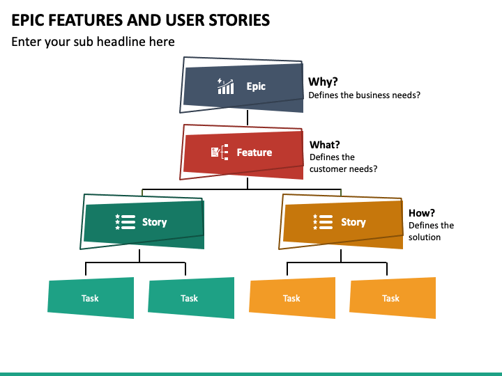

# Project

As a development team (or individual) we will digitally recreate the game of Chutes and Ladders. The reason this game was chose over other grid based games is to increase the complexity to deeply understand design decisions, while exploring common data structures and programming techniques.

## Sprints

A sprint is an Agile term for a time-boxed set of one or more tasks that will lead to project completion. The following heirarchy explains Agile terms and how this project is structured.

* Product - This is the overarching structure that contains all work related to an artical of substance which is manufactured or refined for sale.

* Epics - A group of stories of features that comprise a fixed body of work. Most epics are defined in terms of quarterly work.

* Feature - A group of one or more stories that comprise a fixed set of functionality. For example, a feature may be "User Login" which has many stories for creating the UI, how the state will be stored, etc.

* User Story - Is a time-bound unit of work that can be completed and demonstrated within a single sprint. User stories are written in the following form: "As a [?] I will [?], so that [?]". This purposefully defines the what and why, and not the how.

* Sprint - A time boxed set of user stories. Generally rolling up to a feature or epic.

* Story Points - A system for assigning complexity to a story, a story worth one point is simple, where as a story worth 5 points is complex.

* Task / Bug - Is an individual unit of work related to a user story. Often NOT tracked in the agile process.

* Retrospective - Is a cemeony held at the end of each sprint to discuss What went well, what did not go well, and what to stop/stop doing.

## Our Sprints

If you are running in self-paced mode, or with a group, these sprints are broken down into a weeks worth of tasks for beginning developers?

### Sprint 1 

A set of tasks that will run through the process of functional only development toward Object Oriented development and establish the reasoning behind how to choose which peradigm.

[Details](./sprint-01.md)

### Sprint 2

Considering what was learned in Sprint 1, and how to apply those methods to the Game board. Standard data structures vs. Smart data structures.

[Details](./sprint-02.md)